# Agresso EProc Handler set up and config
Steps followed to uninstall and re-install EProcurement on development servers

## Prove that the current installation works by resending an existing invoice:

Log into test instance of ERP7, go to Requisitions Advanced > Marketplace and click on the "Go Shopping" button

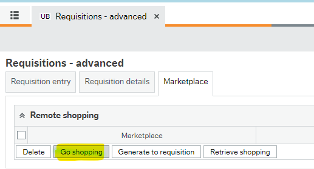

This opens a new browser tab and takes the user out to the Marketplace site via the ReqPunchOut on the AGRUKIsolator:


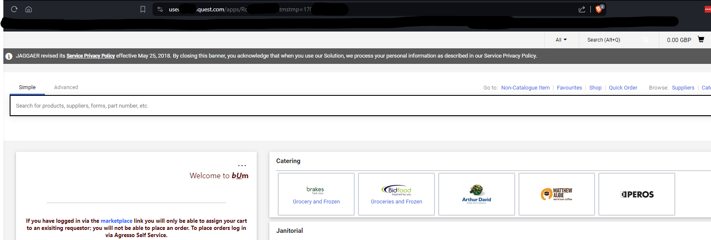

From the marketplace home page user selects Orders > Search > Invoices

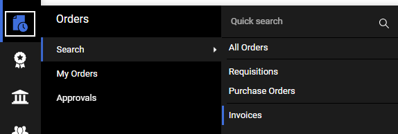

In Invoices screen select the top invoice by clicking on the invoice number

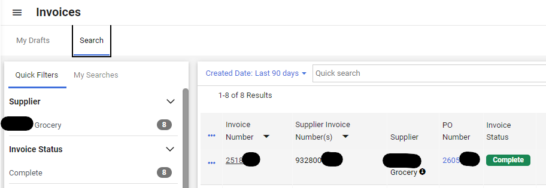

Select the ellipsis on the right hand side and select "Resend Invoice"

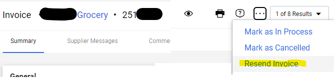

Confirm the destination to send the invoice to is "Invoice Export"

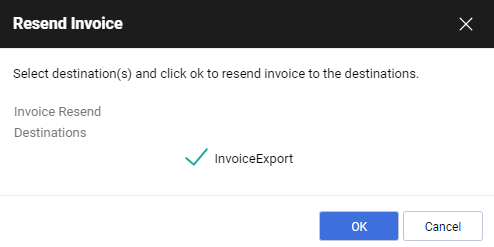

This queues the invoice for sending, user can now exit the marketplace

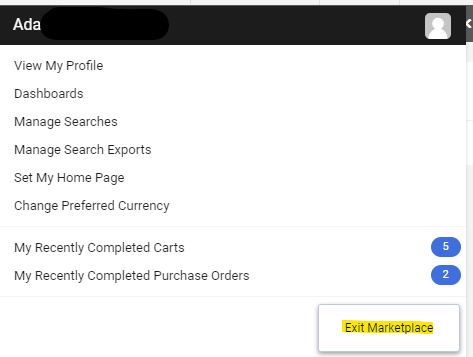

Isolator closes the tab and redirects back to the application

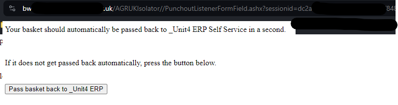

Checking the invoice import folder marketplace has then send the invoice through ready for importing into ERP

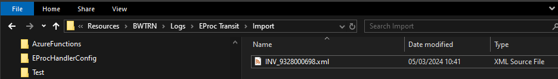

The Isolator log shows the request from Marketplace coming in and resending it to the Handler:

```plaintext
2024-03-05T10:41:30 : Logging started
2024-03-05T10:41:30 : Attempting to retrieve XML
2024-03-05T10:41:30 : _Unit4 ERP Invoice Received : Invoice No 9328000698
2024-03-05T10:41:30 : Repost invoice to business server listener : http://bwtrn-app.xxxxxx.xxxx.xx.uk:9xxx/Import?Password=notused&File=Invoice
2024-03-05T10:41:30 : Invoice being forwarded : <?xml version="1.0"?><ABWInvoice xsi:schemaLocation="http://sexxxxxx.xxxxxx.com/schema/ABWInvxxx/2007/12/24" xmlns="http://serxxxx.agrxxxx.com/schema/ABWInxxxx/2007/12/24" xmlns:agrlib="http://serxxxx.agrxxxx.com/schema/ABWxxxxxxLib/2007/12/24" xmlns:xsi="http://www.w3.org/2001/XMLSchema-instance"><Invoice><InvoiceNo>9328000698</InvoiceNo><Header><agrlib:InvoiceDate>2024-01-30</agrlib:InvoiceDate><agrlib:DueDate>2024-02-29</agrlib:DueDate><OrderRef>26056729</OrderRef><Currency>GBP</Currency><Seller><agrlib:SellerNo>1010xx</agrlib:SellerNo></Seller></Header><Details><Detail><LineNo>1</LineNo><LineTotExclTax>35.8</LineTotExclTax><TaxAmount>0.0</TaxAmount><LineTotInclTax>35.8</LineTotInclTax><agrlib:TaxCode>P2</agrlib:TaxCode><Products><SellerProductCode>19</SellerProductCode><SellerProductDescr>xxxxxxxxxxxxx 1x25</SellerProductDescr><agrlib:UnitCode>EA</agrlib:UnitCode><agrlib:Quantity>2</agrlib:Quantity><Price>17.90</Price></Products><DetailInfo><agrlib:ReferenceCode><agrlib:Code>C1</agrlib:Code><agrlib:Value>CAEC</agrlib:Value></agrlib:ReferenceCode></DetailInfo></Detail></Details><Summary><TotalExclTax>35.8</TotalExclTax><TotalTax>0.0</TotalTax><TotalInclTax>35.8</TotalInclTax></Summary></Invoice></ABWInvoice>
2024-03-05T10:41:30 : Header Name : Content-LengthValue : 251
2024-03-05T10:41:30 : Header Name : DateValue : Tue, 05 Mar 2024 10:41:30 GMT
2024-03-05T10:41:30 : Header Name : ServerValue : Microsoft-HTTPAPI/2.0
2024-03-05T10:41:30 : Response status description : OK
2024-03-05T10:41:30 : Response status : OK
2024-03-05T10:41:30 : Response passed to client : <?xml version="1.0" encoding="UTF-8"?><cXML payloadID="03/05/2024 10:41:30@InvoiceListxxxx.abw" xml:lang="en" timestamp="03/05/2024 10:41:30"><Response><Status code="200" text="OK">Success - _Unit4 ERP Invoice 9328000698 received</Status></Response></cXML>
2024-03-05T10:41:30 : Process duration : 0.0699306 seconds
2024-03-05T10:41:30 : Log closed 
```

The EProcHandler log shows the invoice being received from the AGRUKIsolator

EPHandler log:
```plaintext
10:41    listening	: Web request received from 13xx.xx.xx.xx:54xxx
10:41    listening	: Attempting to retrieve XML
10:41    listening	: ABW Invoice Doc Element : /abw:ABWInvoice/abw:Invoice/abw:InvoiceNo
10:41    listening	: ABW Invoice Received : Invoice No 9328000698
10:41    listening	: Invoice file name : D:\UNIT4\Business Worldxxx\DataFilesxxx\BWxxx\EProc Transit\Import\INV_9328000698.xml
10:41    listening	: Response String : <?xml version="1.0" encoding="UTF-8"?><cXML payloadID="05/03/2024 10:41:30@AGRUKePHandler.abw" xml:lang="en" timestamp="05/03/2024 10:41:30"><Response><Status code="200" text="OK">ABW Invoice Received : Invoice No 9328000698</Status></Response></cXML>
10:41    listening	: Web response sent
```

Demonstrates that currently on the test system the process is working as expected.

## Current Config:

EprocHandler sits on the app server, AGRUKIsolator sits on the web server.
EProc Handler service is running on the app server
AGRUKIsolator running on IIS web server in it's own application pool

## Update the Configuration for EProcurement version 22.1.1
 Before installing take a copy of the current files and folder set up for AGRUKIsolator and the EPHandler.

### AGRUKIsolator on web server
 Copy current directory contents:

 C:\Program Files (x86)\UNIT4 eProcurement\AGRUKIsolator

 to back up directory:
 
 C:\AIHelp\Milestone7\Milestone7\E-Procurement Vulnerability Fix\CurrentSetUp\AGRUKIsolator

 Copy following files from directory C:\Program Files (x86)\UNIT4 Business World On! (v7)\Bin:

 AgressoUK.EPRO.ActObjectFactory.dll
 AgresosUK.EPRO.Client.dll
 AgresosUK.EPRO.InvDefault.dll
 AgresosUK.EPRO.InvProcserve.dll
 AgresosUK.EPRO.InvSciware.dll
 AgresosUK.EPRO.POBasda.dll
 AgresosUK.EPRO.PunchOut.dll
 AgresosUK.EPRO.Server.dll
 AgresosUK.EPRO.Utilities.dll

to back up directory

C:\AIHelp\Milestone7\Milestone7\E-Procurement Vulnerability Fix\CurrentSetUp\bin

Open IIS Manager and stop the AGRUKIsolator app pool:

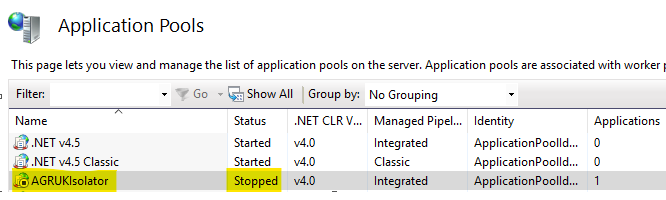

### EPHandler on app server
Stop the AGRUK eProcurement File Handler

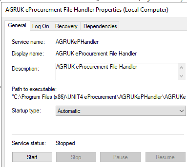

 Copy current directory contents:

C:\Program Files (x86)\UNIT4 eProcurement\AGRUKePHandler

 to back up directory:
 
 C:\AIHelp\Milestone7\Milestone7\E-Procurement Vulnerability Fix\CurrentSetUp\AGRUKePHandler

 Copy following files from directory C:\Program Files (x86)\UNIT4 Business World On! (v7)\Bin:

 AgressoUK.EPRO.ActObjectFactory.dll
 AgresosUK.EPRO.Client.dll
 AgresosUK.EPRO.InvDefault.dll
 AgresosUK.EPRO.InvProcserve.dll
 AgresosUK.EPRO.InvSciware.dll
 AgresosUK.EPRO.POBasda.dll
 AgresosUK.EPRO.PunchOut.dll
 AgresosUK.EPRO.Server.dll
 AgresosUK.EPRO.Utilities.dll

to back up directory

C:\AIHelp\Milestone7\Milestone7\E-Procurement Vulnerability Fix\CurrentSetUp\bin

Uninstall the EPHandler service by opening cmd prompt as Admin and cd to the location of the EProc script.  Issue the command:

```cmd
UninstallService.cmd AGRUKePHandler.exe
```


A log file will be generated in C:\Program Files (x86)\UNIT4 eProcurement\AGRUKePHandler\InstallUtil.InstallLog check for any errors and proceed if ok.

Reboot the server

Once rebooted copy the files from:

C:\AIHelp\Milestone7\Milestone7\E-Procurement Vulnerability Fix\UK-EPROC_22.1.1_M7\AGRUKePHandler

to

C:\Program Files (x86)\UNIT4 eProcurement\AGRUKePHandler

Replace the AGRUKePHandler.exe.config file with the copy taken from the back up directory as this has all the settings we need for EProcHandler for our instance.


From within the command prompt run the install script from within the C:\Program Files (x86)\UNIT4 eProcurement\AGRUKePHandler directory

```cmd
InstallService.cmd AGRUKePHandler.exe
```

Service shows as successfully installed

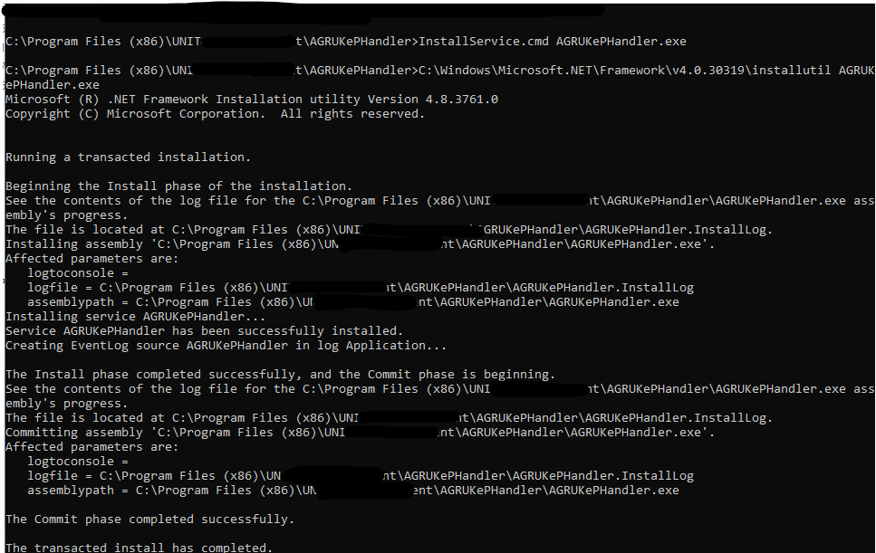

The install log should also have generated and show no errors.

Go into services and start the EPhandler service and set startup type to Automatic

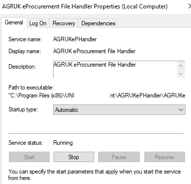

The EPHandler log for the service should have started, check it:

```plaintext
1:31 ePHandlerSvc	: Starting the service . . .
11:31     watching	: FolderName : D:\UNIT4\Business Worldxxx\DataFilxxxx\BWTRN\EProc Transit\Export, Pattern : PO*.xml
11:31     watching	: Found 0 file(s) to process
11:31     watching	: Starting the folder watch using D:\UNIT4\Business Worldxxx\DataFilxxxx\BWTRN\EProc Transit\Export
11:31     watching	: Folder watcher started
11:31    listening	: Starting the web listener on port 9xxx
11:31    listening	: Web listener started and waiting for requests
11:31       timing	: Service timer starting
11:31       timing	: Timer interval 1440 mins
11:31 ePHandlerSvc	: Service started
```

### AGRUKIsolator on web server

Make sure iis is stopped on the server

```cmd
iisreset /stop
```

Copy the files from

 C:\AIHelp\Milestone7\Milestone7\E-Procurement Vulnerability Fix\UK-EPROC_22.1.1_M7\AGRUKIsolator

to

C:\Program Files (x86)\UNIT4 eProcurement\AGRUKIsolator

Copy the back up of the web.config file from 

C:\AIHelp\Milestone7\Milestone7\E-Procurement Vulnerability Fix\CurrentSetUp\AGRUKIsolator

and paste into

C:\Program Files (x86)\UNIT4 eProcurement\AGRUKIsolator

Copy the files from

C:\AIHelp\Milestone7\Milestone7\E-Procurement Vulnerability Fix\UK-EPROC_22.1.1_M7\bin

and paste into 

C:\Program Files (x86)\UNIT4 Business World On! (v7)\Bin

Restart iis on the web server

```cmd
iisreset /start
```

Make sure the AGRUKIsolator app pool is started.

### Test punching out to the marketplace is working:

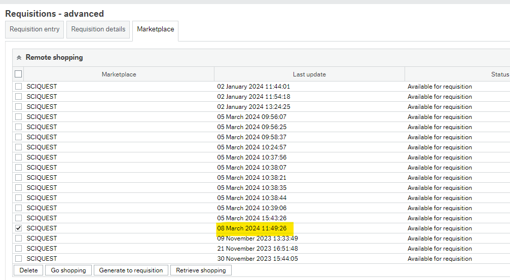

### Test Invoice receiving is working:

Log into test instance of ERP7, go to Requisitions Advanced > Marketplace and click on the "Go Shopping" button


This opens a new browser tab and takes the user out to the Marketplace site via the ReqPunchOut on the AGRUKIsolator:


From the marketplace home page user selects Orders > Search > Invoices


In Invoices screen select the top invoice by clicking on the invoice number


Select the ellipsis on the right hand side and select "Resend Invoice"


Confirm the destination to send the invoice to is "Invoice Export"


This queues the invoice for sending, user can now exit the marketplace


Isolator closes the tab and redirects back to the application


Checking the invoice import folder marketplace has NOT sent the invoice through ready for importing into ERP

The Isolator log shows the request from Marketplace coming in but there being an issue with it:

```plaintext
2024-03-08T11:56:50 : Logging started
2024-03-08T11:56:50 : Attempting to retrieve XML
2024-03-08T11:56:50 : _Unit4 ERP Invoice Received : Invoice No 9328000xxx
2024-03-08T11:56:50 : Repost invoice to business server listener : http://bwtrn-app.xxxx.xxx.xx.uk:9xxx/Import?Password=notused&File=Invoice
2024-03-08T11:56:50 : Invoice being forwarded : <?xml version="1.0"?><ABWInvoice xsi:schemaLocation="http://services.agrxxxx.com/schema/ABWInvoixx/2007/12/24" xmlns="http://services.agrexxxx.com/schema/ABWInvoixxx/2007/12/24" xmlns:agrlib="http://services.agrexxxx.com/schema/ABWSchemaLib/2007/12/24" xmlns:xsi="http://www.w3.org/2001/XMLSchema-instance"><Invoice><InvoiceNo>9328000xxx</InvoiceNo><Header><agrlib:InvoiceDate>2024-01-30</agrlib:InvoiceDate><agrlib:DueDate>2024-02-29</agrlib:DueDate><OrderRef>260567xx</OrderRef><Currency>GBP</Currency><Seller><agrlib:SellerNo>101xxx</agrlib:SellerNo></Seller></Header><Details><Detail><LineNo>1</LineNo><LineTotExclTax>35.8</LineTotExclTax><TaxAmount>0.0</TaxAmount><LineTotInclTax>35.8</LineTotInclTax><agrlib:TaxCode>P2</agrlib:TaxCode><Products><SellerProductCode>19</SellerProductCode><SellerProductDescr>Westler xxxxxxxxx</SellerProductDescr><agrlib:UnitCode>EA</agrlib:UnitCode><agrlib:Quantity>2</agrlib:Quantity><Price>17.90</Price></Products><DetailInfo><agrlib:ReferenceCode><agrlib:Code>C1</agrlib:Code><agrlib:Value>CAEC</agrlib:Value></agrlib:ReferenceCode></DetailInfo></Detail></Details><Summary><TotalExclTax>35.8</TotalExclTax><TotalTax>0.0</TotalTax><TotalInclTax>35.8</TotalInclTax></Summary></Invoice></ABWInvoice>
2024-03-08T11:56:52 : Web Exception message : The underlying connection was closed: An unexpected error occurred on a receive.
2024-03-08T11:56:52 : Response passed to client : <?xml version="1.0" encoding="UTF-8"?><cXML payloadID="03/08/2024 11:56:50@InvoiceListener.abw" xml:lang="en" timestamp="03/08/2024 11:56:50"><Response><Status code="200" text="OK">Success - _Unit4 ERP Invoice 932800xxxx received</Status></Response></cXML>
2024-03-08T11:56:52 : Process duration : 2.6025653 seconds
2024-03-08T11:56:52 : Log closed 
```

The Handler log shows nothing has been received:

```plaintext
11:31 ePHandlerSvc	: Starting the service . . .
11:31     watching	: FolderName : D:\UNIT4\Business World\DataFiles\BWTRN\EProc Transit\Export, Pattern : PO*.xml
11:31     watching	: Found 0 file(s) to process
11:31     watching	: Starting the folder watch using D:\UNIT4\Business World\DataFiles\BWTRN\EProc Transit\Export
11:31     watching	: Folder watcher started
11:31    listening	: Starting the web listener on port 9xxx
11:31    listening	: Web listener started and waiting for requests
11:31       timing	: Service timer starting
11:31       timing	: Timer interval 1440 mins
11:31 ePHandlerSvc	: Service started
```

When checking the Marketplace site for the invoice shows that it received a 404 back from the Isolator

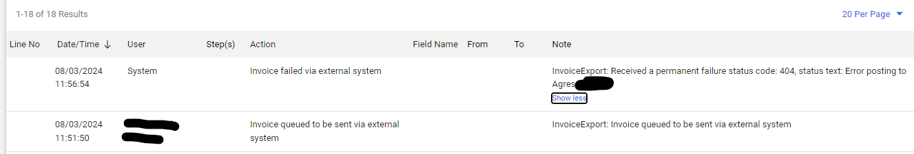

### Test sending PO to Marketplace is working

Requisition created and saved, converted to a PO, intelagent picks up the PO and puts it in the relevant folder for the UECX process to move it is then processed by EPHandler and sent successfully to the marketplace:

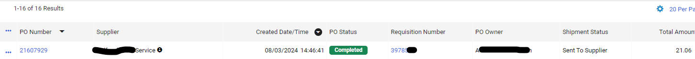

EPHandler log shows:

```plaintext
14:46 ePHandlerSvc	: Starting the service . . .
14:46     watching	: FolderName : D:\UNIT4\Business Woxxxx\Dataxxxx\BWTRN\EProc Transit\Export, Pattern : PO*.xml
14:46     watching	: Found 1 file(s) to process
14:46     watching	: Process D:\UNIT4\Business Wxxxxx\Dataxxxx\BWTRN\EProc Transit\Export\PO01_xxxxxx_319278.xml 
14:46     watching	: Process file D:\UNIT4\Businesxxxxx\Dataxxxx\BWTRN\EProc Transit\Export\PO01_xxxxxx_319278.xml
14:46     watching	: Connecting to URL: https://bwtrn-web.xxxxxxxx.uk/agrukisolator/SQPurchaseOrderProxy.ashx
14:46     watching	: XML file length: 2490
14:46     watching	: Decode incoming message
14:46     watching	: Remove dtd
14:46     watching	: Received from Remote XML Gateway : <?xml version='1.0' encoding='UTF-8'?><cXML payloadID='03/08/2024 14:46:42@SQPurchaseOrderProxy.abw' xml:lang='en' timestamp='03/08/2024 14:46:42'><Response><Status code='200' text='Success'>No status message</Status></Response></cXML> OK
14:46     watching	: Status code : 200
14:46     watching	: D:\UNIT4\Business xxxxxx\Dataxxxxxx\BWTRN\EProc Transit\Export\PO01_1xxxxxx_319278.xml moved to export success
14:46     watching	: Starting the folder watch using D:\UNIT4\Businessxxxxxx\Dataxxxxxxxx\BWTRN\EProc Transit\Export
14:46     watching	: Folder watcher started
14:46    listening	: Starting the web listener on port 9000
14:46    listening	: Web listener started and waiting for requests
14:46       timing	: Service timer starting
14:46       timing	: Timer interval 1440 mins
14:46 ePHandlerSvc	: Service started
```

Isolator SQPurchaseOrderProxy log shows:

```plaintext
2024-03-08T14:46:41 : Logging started
2024-03-08T14:46:41 : AGRUKIsolator.SQPurchaseOrderProxy version 7.22.1.1
2024-03-08T14:46:41 : Trust all certificates enabled
2024-03-08T14:46:41 : Attempting to retrieve incoming XML
2024-03-08T14:46:41 : xmlPORequest loaded into DOM OK
2024-03-08T14:46:41 : Transmission URL = https://sciwmxxxxxxxxxxx.com/invoke/Bath_POImport.POImport:POImport
2024-03-08T14:46:41 : Forwarding PO data to marketplace
2024-03-08T14:46:41 : Marketplace URL = https://sciwxxxxxxxxxxxxxx.com/invoke/Bath_POImport.POImport:POImport
2024-03-08T14:46:41 : Create request
2024-03-08T14:46:41 : Convert PO to bytes
2024-03-08T14:46:42 : Response content length : 469
2024-03-08T14:46:42 : Response content type : text/xml; charset=UTF-8
2024-03-08T14:46:42 : Response from the PO receiver : <?xml version="1.0"?>
<!DOCTYPE DocumentExportResponse SYSTEM "http://soluxxxxxxxxxxxxx.com/app_docs/dtd/documentExport/DocumentExport.dtd">
<DocumentExportResponse version="1.0">
  <Header>
    <MessageId>2024-03-08T09:46:42.854-0500</MessageId>
    <Timestamp>2024-03-08T09:46:42.854-0500</Timestamp>
  </Header>
  <Response>
    <Status>
      <StatusCode>200</StatusCode>
      <StatusText>Success</StatusText>
    </Status>
  </Response>
</DocumentExportResponse>
2024-03-08T14:46:42 : Removed dtd
2024-03-08T14:46:42 : Response from PO Receiver : 200 Success No status message
2024-03-08T14:46:42 : Message passed to calling browser : <?xml version="1.0" encoding="UTF-8"?><cXML payloadID="03/08/2024 14:46:42@SQPurchaseOrderProxy.abw" xml:lang="en" timestamp="03/08/2024 14:46:42"><Response><Status code="200" text="Success">No status message</Status></Response></cXML>
2024-03-08T14:46:42 : Process duration : 1.5279555 seconds
```

### Conclusion

Currently the patch is NOT working for receiving invoices from the marketplace.

Punch out for online shopping is working
Sending PO's out to marketplace is working.
