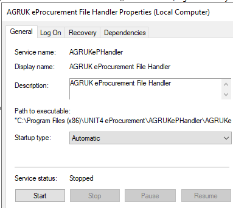

# Agresso EProc Handler set up and config
This document follows on from the original document [EProcHandlerConfig.md ](https://github.com/Adamski443/Documentation/blob/main/Agresso/EProcHandlerConfig.md) and should be read secondly to the original.

Steps followed to uninstall and re-install EProcurement on development servers in relation to a bug fix.  Following summary of process:

- Stop and Uninstall EProcHandler Service on app server
- Reboot server
- Copy the contents from `C:\Program Files (x86)\UNIT4 eProcurement\AGRUKePHandler` to `C:\Program Files (x86)\UNIT4 Business World On! (v7)\Bin`
- Re-install EProchandler service from the `C:\Program Files (x86)\UNIT4 Business World On! (v7)\Bin` location
- Check `AGRUKePHandler.exe.config` file has correct values.
- Start service and test receiving an invoice

## Detailed Config

### EPHandler on app server
Stop the AGRUK eProcurement File Handler



 Copy the contents from
  `C:\Program Files (x86)\UNIT4 eProcurement\AGRUKePHandler`
  to
  `C:\Program Files (x86)\UNIT4 Business World On! (v7)\Bin`

Uninstall the EPHandler service by opening cmd prompt as Admin and cd to the location of the EProc script.  Issue the command:

```cmd
UninstallService.cmd AGRUKePHandler.exe
```


A log file will be generated in C:\Program Files (x86)\UNIT4 eProcurement\AGRUKePHandler\InstallUtil.InstallLog check for any errors and proceed if ok.

Reboot the server

Replace the AGRUKePHandler.exe.config file with the copy taken from the back up directory as this has all the settings we need for EProcHandler for our instance.


From within the command prompt run the install script from within the directory

`C:\Program Files (x86)\UNIT4 Business World On! (v7)\Bin`

```cmd
InstallService.cmd AGRUKePHandler.exe
```

Service shows as successfully installed


The install log should also have generated and show no errors.

Go into services and start the EPhandler service and set startup type to Automatic


The EPHandler log for the service should have started, check it:

```plaintext
13:48 ePHandlerSvc	: Starting the service . . .
13:48     watching	: FolderName : D:\UNIT4\Business Woxxxxx\DataFilexxxx\BWTRN\EProc Transit\Export, Pattern : PO*.xml
13:48     watching	: Found 0 file(s) to process
13:48     watching	: Starting the folder watch using D:\UNIT4\Business Woxxxxx\DataFilxxxx\BWTRN\EProc Transit\Export
13:48     watching	: Folder watcher started
13:48    listening	: Starting the web listener on port 9xx
13:48    listening	: Web listener started and waiting for requests
13:48       timing	: Service timer starting
13:48       timing	: Timer interval 1440 mins
13:48 ePHandlerSvc	: Service started
```

Retested an invoice and this time it worked as expected. :)


