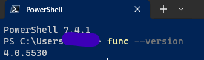
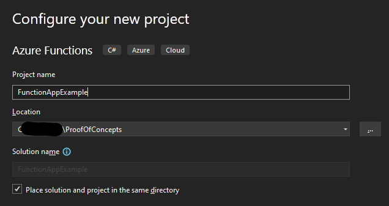
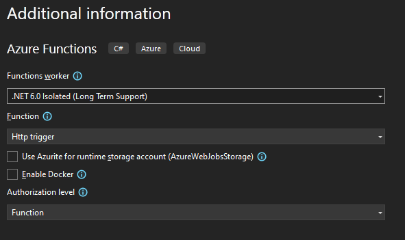
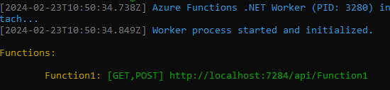
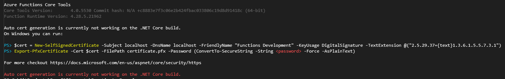
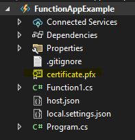
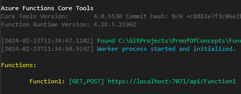

# Azure Function Running Locally On Https
## Overview
This document details how to set up a local environment in Visual Studio 2022, running on a Windows 10, x64 laptop, a simple function app.  By default the template function app in Visual Studio is not set up for https, instead it uses `http://localhost:<port>/yourfunctionapp`.  In this example I want to use https for my local development.

## Pre-Requisites
- Windows 10 64bit  pc or later
- Visual Studio 2022 edition or later
- Admin Rights on your pc or laptop

## Configuration
Install [Azure Functions Core Tools](https://learn.microsoft.com/en-us/azure/azure-functions/functions-run-local?tabs=windows%2Cisolated-process%2Cnode-v4%2Cpython-v2%2Chttp-trigger%2Ccontainer-apps&pivots=programming-language-csharp#install-the-azure-functions-core-tools) on your local PC.  If you already have Azure Functions Core Tools installed then you may want to un-install it by using Add/Remove Programs and then download the msi from the [Azure Functions Core Tools](https://learn.microsoft.com/en-us/azure/azure-functions/functions-run-local?tabs=windows%2Cisolated-process%2Cnode-v4%2Cpython-v2%2Chttp-trigger%2Ccontainer-apps&pivots=programming-language-csharp#install-the-azure-functions-core-tools) site and run it.  This should then install Azure Function Core Tools globally.

Check that the Azure Function Core Tools has installed correctly by opening powershell and issuing the following command, you should get the version number returned:
```powershell
func --version
```
you should get



Set the environment variable AzureWebJobsDisableHomepage to true.  For background the variable is used in Azure Functions to control whether the default homepage is enabled or disabled.  When AzureWebJobsDisableHomepage is set to true, it disables the default homepage for your Azure Functions app.
```powershell
# This command sets the environment variable globally, so it persists across sessions.
setx AzureWebJobsDisableHomepage true
```

Open Visual Studio and select "Create a new Project", search for "Azure Functions"

Give the project a name "FunctionAppExample"



Select the functions worker, I'd recommend using the Long Term Release of dotnet: at time of writing this is .Net6.0 Isolated (Long Term Support)

In this example my trigger is an http request and I'm not going to use Azurite or Docker and the Authorisation level is Function:



Click Create to create the templated function app.

Once the function app has been created, test it to make sure it's working on the out of the box `http://localhost:<port>/FunctionAppExample` site, a command prompt will appear with the localhost it is running on:



You can then copy and paste this url into your browser and it should return the standard out of the box message:

"Welcome to Azure Functions!"

Stop the function app in visual studio as we now need to set it up to use https instead of http.

Apparently you should be able to use the Azure Functions Core Tools to start your app with https, but it currently has an issue which Microsoft are aware of.  To run and see the current error in the "Developer Powershell" window that is part of visual studio you can do so by making sure you are in the root directory of your function app and then issue the following command:
```powershell
func start --useHttps
```
This starts the function app and attempts to make it use a self signed cert to implement https but it fails:



```
Azure Functions Core Tools
Core Tools Version:       4.0.5530 Commit hash: N/A +c8883e7f3c (64-bit)
Function Runtime Version: 4.28.5.21962

Auto cert generation is currently not working on the .NET Core build.
On Windows you can run:

PS> $cert = New-SelfSignedCertificate -Subject localhost -DnsName localhost -FriendlyName "Functions Development" -KeyUsage DigitalSignature -TextExtension @("2.5.29.37={text}1.3.6.1.5.5.7.3.1")
PS> Export-PfxCertificate -Cert $cert -FilePath certificate.pfx -Password (ConvertTo-SecureString -String <password> -Force -AsPlainText)

For more checkout https://docs.microsoft.com/en-us/aspnet/core/security/https

Auto cert generation is currently not working on the .NET Core build.
```
So it seems that automatic certificate generation is not supported in the .NET Core build of Azure Functions. To get round this we can manually generate a self-signed certificate using PowerShell, as indicated in the message received. Here's how to do it:

Open powershell as an administrator and browse to your Function App directory where your visual studio solution is.  Then Create a variable to hold you self signed certificate:
```
#This command creates a self-signed certificate with the subject and DNS name set to localhost. You can adjust these values as needed.
$cert = New-SelfSignedCertificate -Subject localhost -DnsName localhost -FriendlyName "Functions Development" -KeyUsage DigitalSignature -TextExtension @("2.5.29.37={text}1.3.6.1.5.5.7.3.1")
```

After generating the certificate, export it to a PFX file using the following command in powershell:
```
#Create a variable to hold the certs password in example below it's test
$pw = ConvertTo-SecureString -String "test" -Force -AsPlainText

#Use the pw variable to export the self signed cert into your function app project
Export-PfxCertificate -Cert $cert -FilePath certificate.pfx -Password $pw
```
After exporting the certificate.pfx should be showing at the root level of your Function App in Visual Studio:



Once the certificate is exported to a PFX file (certificate.pfx), you can use it in your Azure Functions project for local development with HTTPS.

To use the specific certificate with func start --useHttps, you need to specify the path to the certificate file and provide the password if it's protected. Here's how to do it:

```
func start --useHttps --cert <certificate_path> --password <certificate_password>
```

Your function app should now start and show that it is running on https:



You should also be able to access it from a browser, but because it is a self signed cert you'll get browser security warnings, but you should still be able to get past these to the localhost site.


